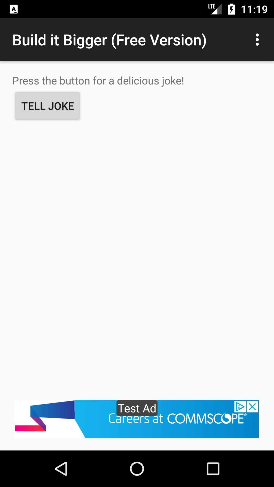
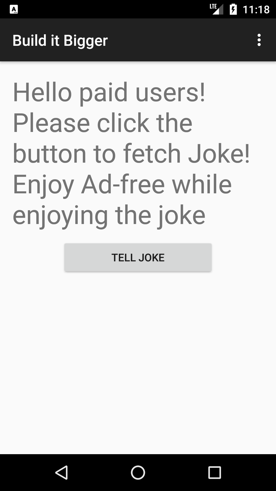

# Gradle Multi Project Build including Android

<table>
<thead>
<tr>
<th>Free</th>
<th>Paid</th>
</tr>
</thead>
<tbody>
<tr>
<td></td>
<td></td>
</tr>
</tbody>
</table>

## Checklist

- [x] App is written solely in the Java Programming Language
- [x] App utilizes stable release versions of all libraries, Gradle, and Android Studio.
- [x] Project contains a Java library for supplying jokes.
- [ ] Project contains an Android library with an activity that displays jokes passed to it as intent extras.
  - Instead, the activity is self contained. It renders a random joke at the open. 
- [x] Project contains a Google Cloud Endpoints module that supplies jokes from the Java library. Project loads jokes from GCE module via an AsyncTask.
- [x] Project contains connected tests to verify that the AsyncTask is indeed loading jokes.
- [x] Project contains paid/free flavors. The paid flavor has no ads and no unnecessary dependencies.
- [x] Ads are required in the free version.
- [x] App retrieves jokes from Google Cloud Endpoints module and displays them via an Activity from the Android Library. Note that the GCE module need only be deployed locally.
- [x] App conforms to common standards found in the Android Nanodegree General Project Guidelines.
